<div align="center">

# 📊 Data Transformer — SQL Project

**Turning raw relational data into clear, useful insights with MySQL**


*A hands-on SQL project demonstrating joins, subqueries, date and string transformations, conditional logic, and window functions.*

</div>

---

## 📌 Project Overview

**Data Transformer** is a MySQL practice project that explores how to combine, clean, transform, and analyze customer, order, and employee data. It uses three tables and a small sample dataset to demonstrate practical SQL patterns commonly used in data analysis and reporting.

The project includes **17 query examples** with screenshots of their output. The queries cover relational joins, above-average comparisons, date formatting, text cleanup, running totals, ranking, discounts, and salary categories.

## 🎯 Project Goals

- Connect related records across tables using SQL joins.
- Compare values against aggregate results using subqueries.
- Extract, calculate, and format date values.
- Standardize text with string functions.
- Build cumulative totals and rankings with window functions.
- Apply business rules using `CASE` expressions.
- Present query outputs with clear, reviewable screenshots.

## 🧰 Tools & Technologies

| Tool / Concept | How it is used |
|---|---|
| **MySQL** | Relational database and query execution |
| **SQL DDL** | Create the database and tables |
| **SQL DML** | Insert the sample records |
| **JOINs** | Combine customers and orders |
| **Subqueries & aggregates** | Compare order totals and salaries against averages |
| **Date & string functions** | Format dates and clean or transform text |
| **Window functions** | Calculate running totals and order ranks |
| **CASE expressions** | Calculate discounts and categorize salaries |

## 🗃️ Database Structure

The database contains three tables:

| Table | Purpose | Sample size |
|---|---|---:|
| `Customers` | Customer details and registration dates | 8 rows |
| `Orders` | Order dates, customer IDs, and order amounts | 12 rows |
| `Employees` | Employee details, departments, hire dates, and salaries | 8 rows |

### 🔗 Logical Relationship

`Orders.CustomerID` is matched with `Customers.CustomerID` in the JOIN queries. The supplied schema uses this as a query relationship; it does not declare a foreign-key constraint on `Orders.CustomerID`.

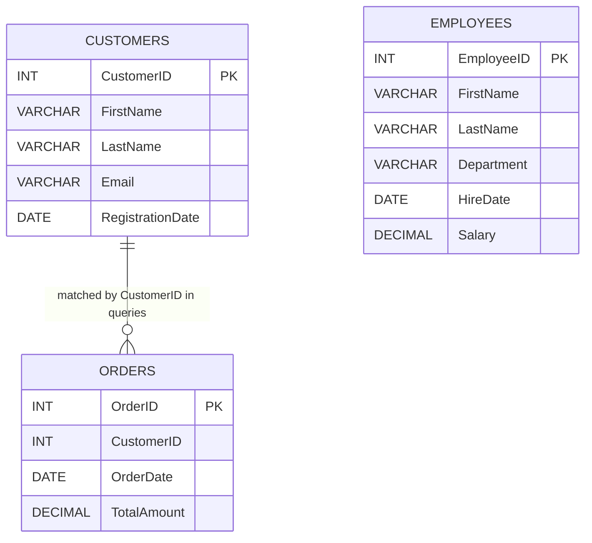

## 📈 Project Workflow — Flowchart

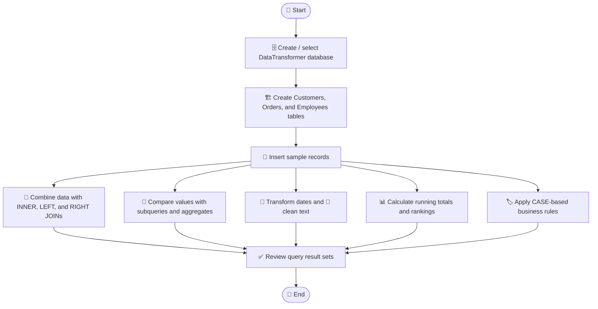

## 🚀 How to Run the Project

1. Install and open **MySQL Server** using MySQL Workbench or the MySQL command-line client.
2. Open `DataTransformer.sql`.
3. Run the script against a MySQL server. It creates/selects the `DataTransformer` database, creates the tables if missing, and inserts the example rows.
4. Review the query outputs in order. The screenshots below show the sample results captured for this project.

**Command-line option:**

```bash
mysql -u your_username -p < DataTransformer.sql
```

Replace `your_username` with your local MySQL username. The sample inserts use `INSERT IGNORE` so existing sample IDs do not raise duplicate-primary-key errors when the script is run again; existing records are not overwritten.

> ℹ️ The `DaysSinceOrder` result depends on the current date because it uses `CURDATE()`.

## 🧠 SQL Concepts Demonstrated

| # | Query / concept | What it demonstrates |
|---:|---|---|
| 1 | `INNER JOIN` | Returns orders that match a customer. |
| 2 | `LEFT JOIN` | Keeps every customer, including customers without an order. |
| 3 | `RIGHT JOIN` | Keeps every order and its matching customer when available. |
| 4 | Full-outer-join equivalent | Combines `LEFT JOIN` and `RIGHT JOIN` using `UNION`, since MySQL does not provide a direct `FULL OUTER JOIN` syntax. |
| 5 | Average-order subquery | Finds customers with an order amount above the overall order average. |
| 6 | Average-salary subquery | Finds employees whose salary is above the employee average. |
| 7 | `YEAR()` and `MONTH()` | Extracts year and month from an order date. |
| 8 | `DATEDIFF()` | Calculates days elapsed since an order date. |
| 9 | `DATE_FORMAT()` | Displays dates in a readable format. |
| 10 | `CONCAT()` | Creates a full name from first and last name. |
| 11 | `REPLACE()` | Shows a transformed first name without updating the stored row. |
| 12 | `UPPER()` and `LOWER()` | Changes the display case of name values. |
| 13 | `TRIM()` | Removes leading and trailing spaces from emails. |
| 14 | `SUM() OVER()` | Calculates the cumulative order amount. |
| 15 | `RANK() OVER()` | Ranks orders from highest amount to lowest. |
| 16 | `CASE` | Assigns discount labels and calculates final order amounts. |
| 17 | `CASE` | Groups employee salaries into High, Medium, and Low categories. |

## 🖼️ Query Results & Screenshots

Each screenshot below shows the MySQL query and its result. Images use relative paths, so they will display on GitHub as long as the `ss` folder is uploaded beside this README.

### 1. 🔗 JOIN Operations

<details open>
<summary><strong>01 — INNER JOIN: Orders with Customer Details</strong></summary>

Combines orders with the details of matching customers.

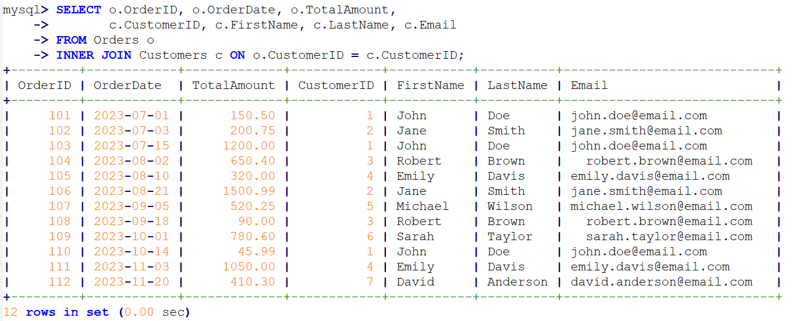
</details>

<details>
<summary><strong>02 — LEFT JOIN: All Customers and Their Orders</strong></summary>

Shows all customers, including Olivia Thomas, who has no matching order in the sample data.

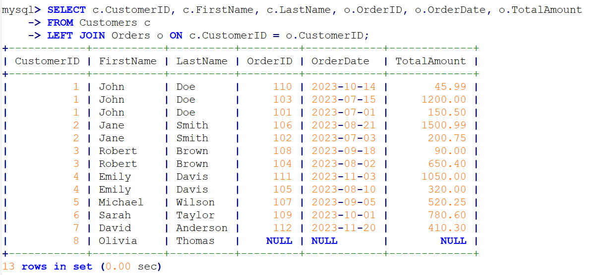
</details>

<details>
<summary><strong>03 — RIGHT JOIN: All Orders with Customer Details</strong></summary>

Keeps all order records and returns matching customer information.

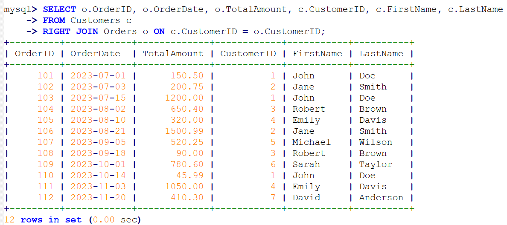
</details>

<details>
<summary><strong>04 — FULL OUTER JOIN Equivalent</strong></summary>

Uses `LEFT JOIN` and `RIGHT JOIN` combined with `UNION` to show both sides of the relationship.

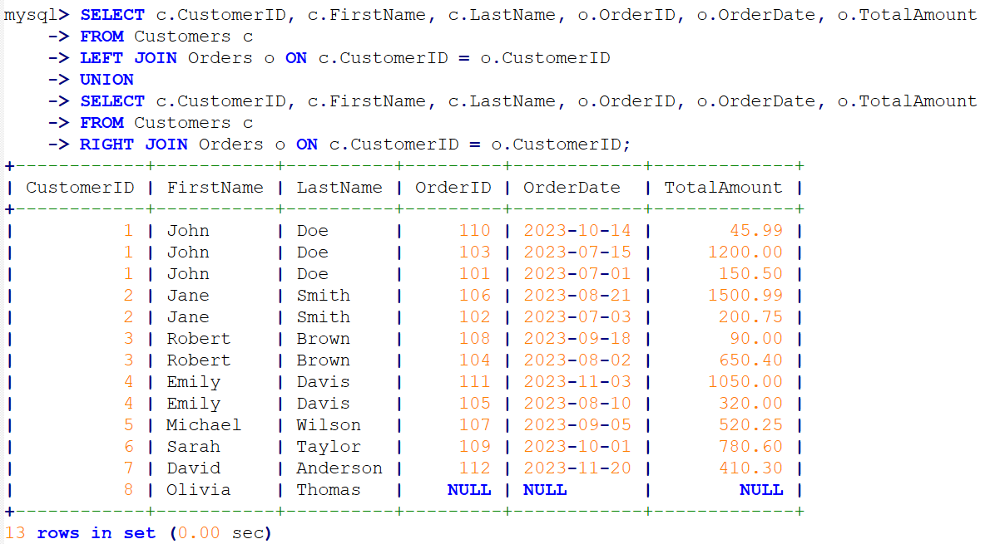
</details>

### 2. 🧮 Subqueries & Aggregate Comparisons

<details>
<summary><strong>05 — Customers with Above-Average Order Amounts</strong></summary>

Uses a subquery with `AVG()` to find customers with at least one order above the overall average order amount.

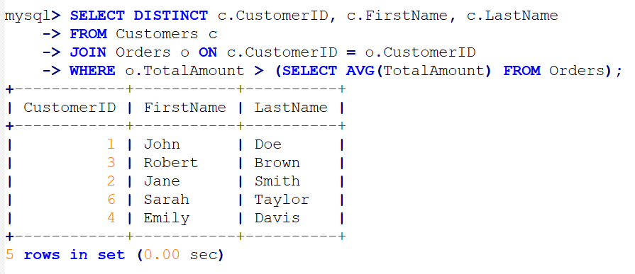
</details>

<details>
<summary><strong>06 — Employees Earning Above the Average Salary</strong></summary>

Compares each employee's salary with the average salary from the `Employees` table.

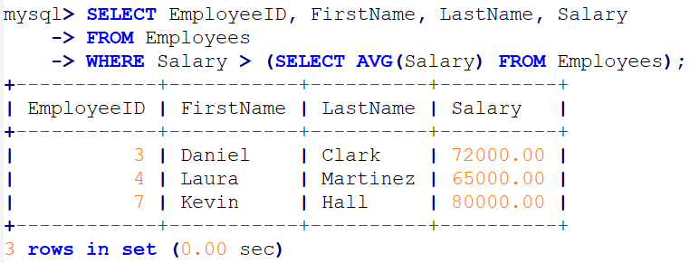
</details>

### 3. 📅 Date Transformations

<details>
<summary><strong>07 — Extract Year and Month</strong></summary>

Uses `YEAR()` and `MONTH()` to create separate year and month columns from `OrderDate`.

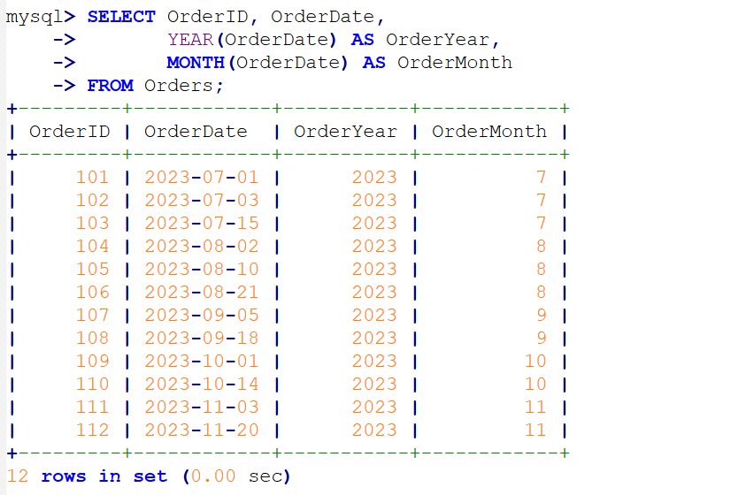
</details>

<details>
<summary><strong>08 — Days Since Each Order</strong></summary>

Uses `DATEDIFF()` and `CURDATE()` to calculate the elapsed days for each order.

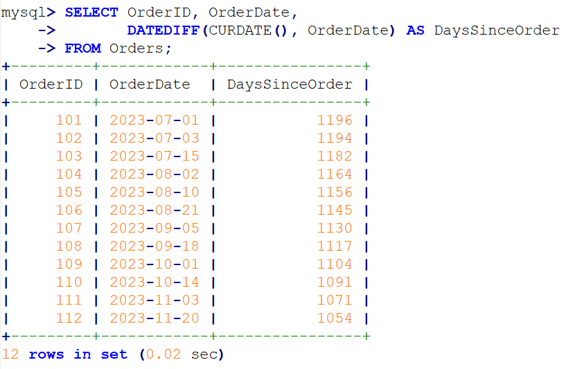
</details>

<details>
<summary><strong>09 — Readable Date Format</strong></summary>

Uses `DATE_FORMAT()` to display dates in a `DD-Mon-YYYY` style.

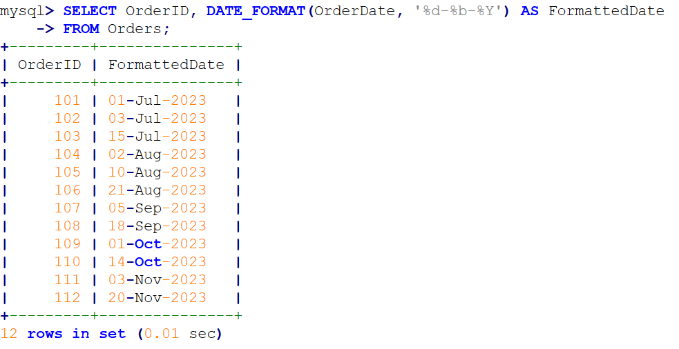
</details>

### 4. 🧹 String Transformations

<details>
<summary><strong>10 — Concatenate Customer Names</strong></summary>

Uses `CONCAT()` to produce a full name.

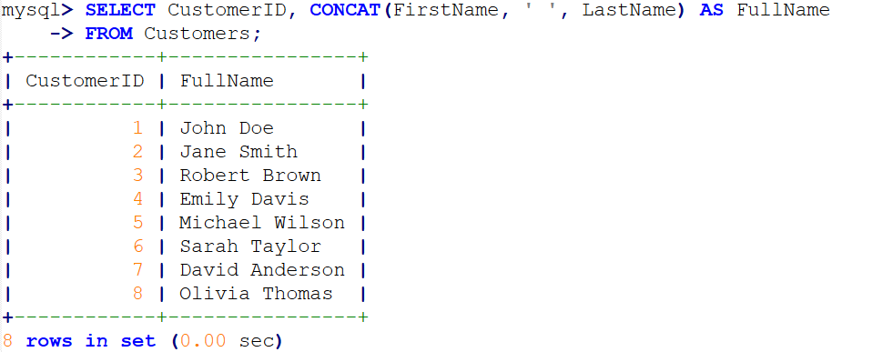
</details>

<details>
<summary><strong>11 — Replace a Name in the Query Output</strong></summary>

Uses `REPLACE()` to display `John` as `Jonathan`; the query does not update the stored table.

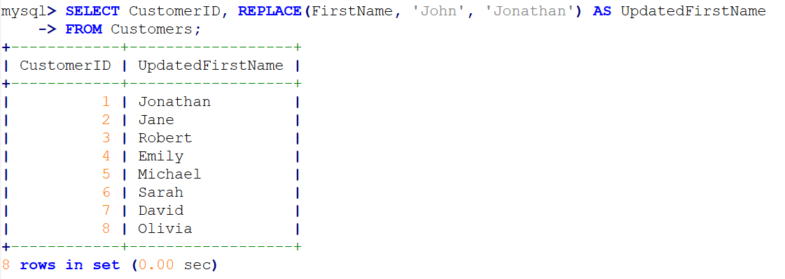
</details>

<details>
<summary><strong>12 — Uppercase and Lowercase</strong></summary>

Uses `UPPER()` for first names and `LOWER()` for last names.

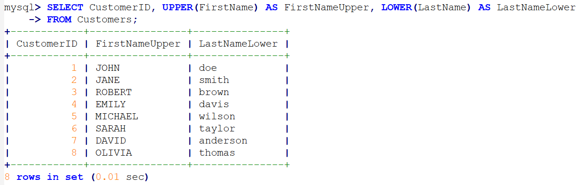
</details>

<details>
<summary><strong>13 — Clean Email Text</strong></summary>

Uses `TRIM()` to remove leading and trailing whitespace from email values.

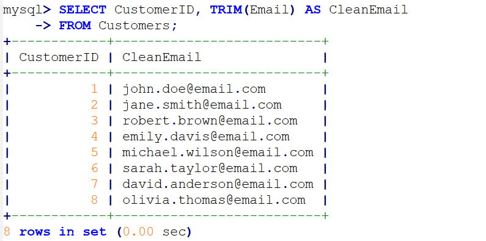
</details>

### 5. 📊 Window Functions & Business Rules

<details>
<summary><strong>14 — Running Total of Order Amounts</strong></summary>

Uses `SUM() OVER (ORDER BY ...)` to calculate the cumulative amount by order date and ID.

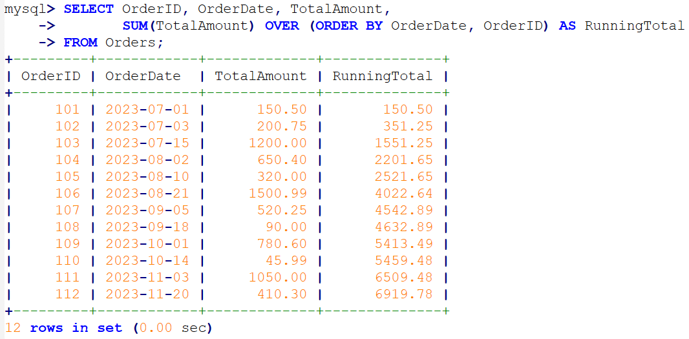
</details>

<details>
<summary><strong>15 — Rank Orders by Amount</strong></summary>

Uses `RANK() OVER (ORDER BY TotalAmount DESC)` to rank the largest order first.

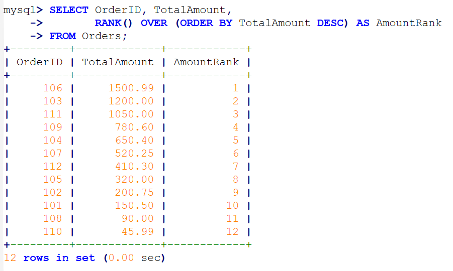
</details>

<details>
<summary><strong>16 — Discounts and Final Amounts</strong></summary>

Uses `CASE` to apply a 10% discount to orders above 1,000, a 5% discount to orders above 500, and no discount otherwise.

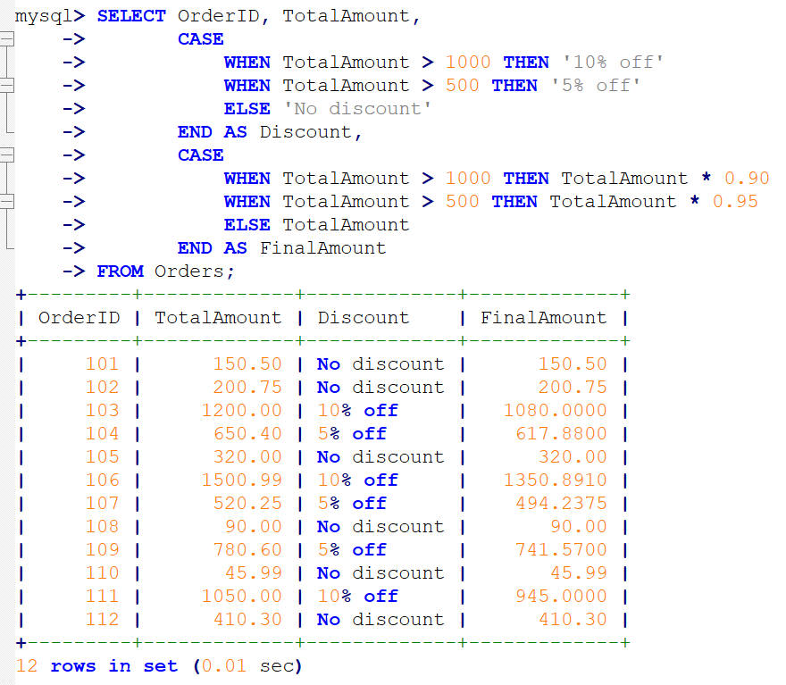
</details>

<details>
<summary><strong>17 — Employee Salary Categories</strong></summary>

Uses `CASE` to categorize salaries as High (at least 60,000), Medium (at least 50,000), or Low.

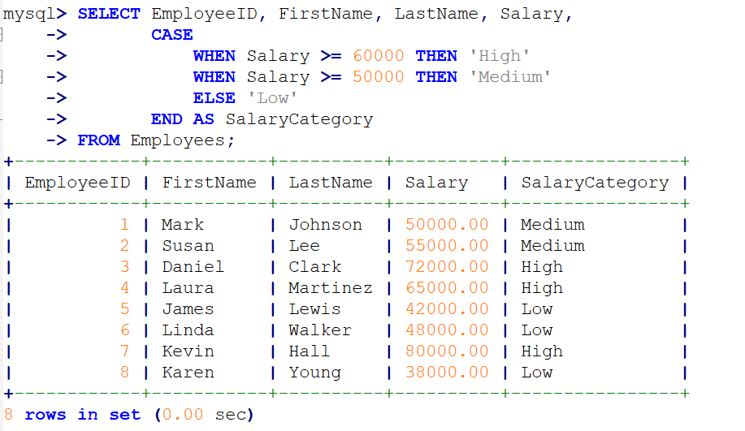
</details>

## 📁 Project Structure

```text
DataTransformer_Project/
├── README.md
├── DataTransformer.sql
└── ss/
    ├── 01-inner-join.png
    ├── 02-left-join.png
    ├── 03-right-join.png
    ├── 04-full-outer-join.png
    ├── 05-customers-above-average-order.png
    ├── 06-employees-above-average-salary.png
    ├── 07-order-year-and-month.png
    ├── 08-days-since-order.png
    ├── 09-formatted-order-date.png
    ├── 10-concatenate-customer-name.png
    ├── 11-replace-first-name.png
    ├── 12-uppercase-and-lowercase.png
    ├── 13-trim-email.png
    ├── 14-running-total.png
    ├── 15-order-ranking.png
    ├── 16-discount-and-final-amount.png
    └── 17-salary-categories.png
```

## ✅ Key Learning Outcomes

- Practiced multiple join patterns and understood how unmatched customer records appear in a `LEFT JOIN`.
- Used aggregate functions inside subqueries for data comparisons.
- Cleaned text and formatted dates for reporting.
- Applied window functions to create cumulative totals and rankings.
- Expressed simple business rules with `CASE` statements.
- Documented query outputs with reproducible examples and screenshots.

## 🔮 Possible Next Improvements

- Add indexes and compare query execution plans with `EXPLAIN`.
- Add foreign-key constraints and more validation rules where appropriate.
- Create reusable views for frequently used reports.
- Extend the dataset and add monthly or department-level reporting.

## 👋 About This Project

This project was created as a practical demonstration of SQL querying and data transformation fundamentals. The examples are intentionally small so each query and its result can be inspected easily.

---

<div align="center">

**Thanks for checking out this project!** ⭐

*Built with SQL, curiosity, and a focus on learning by doing.*

</div>
